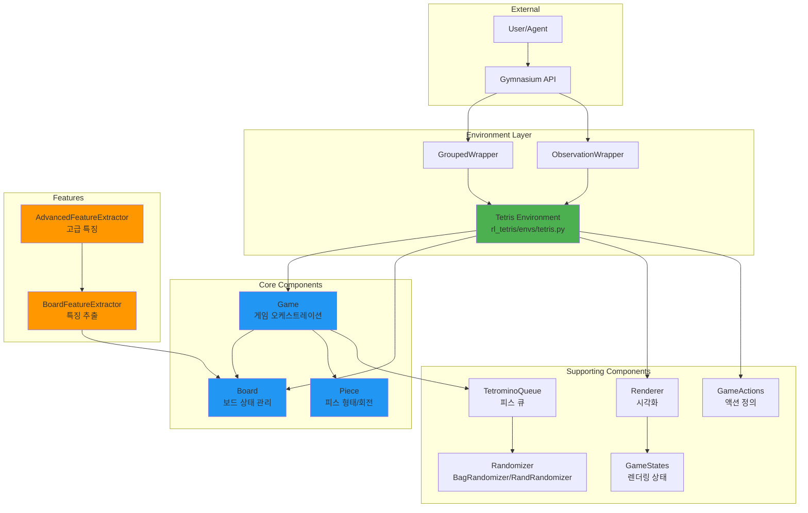
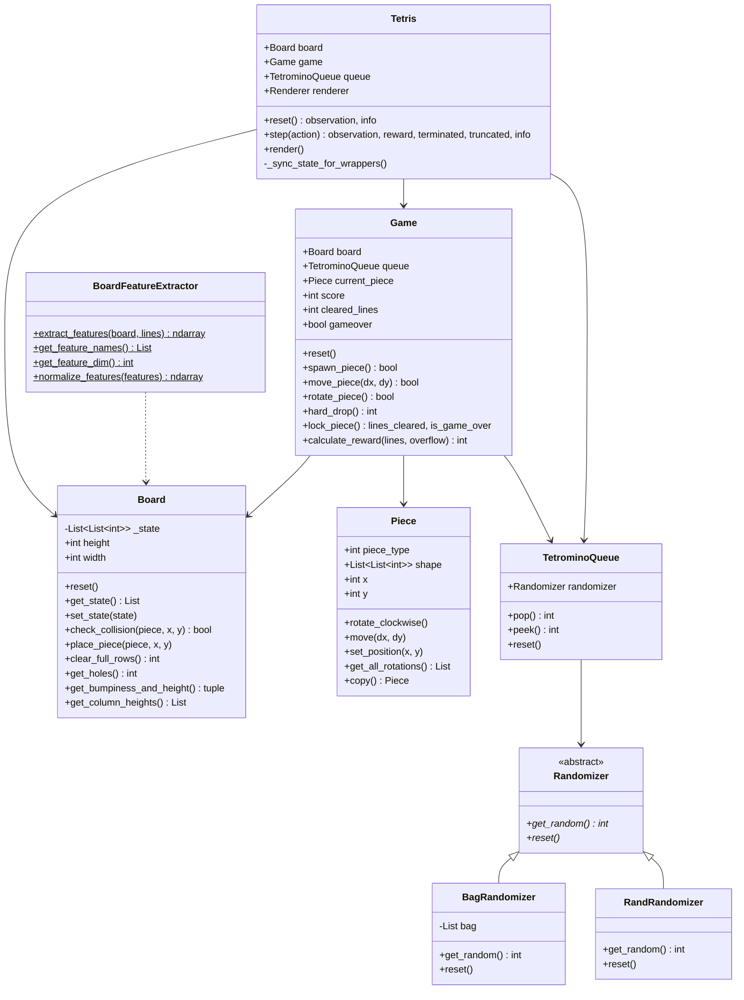
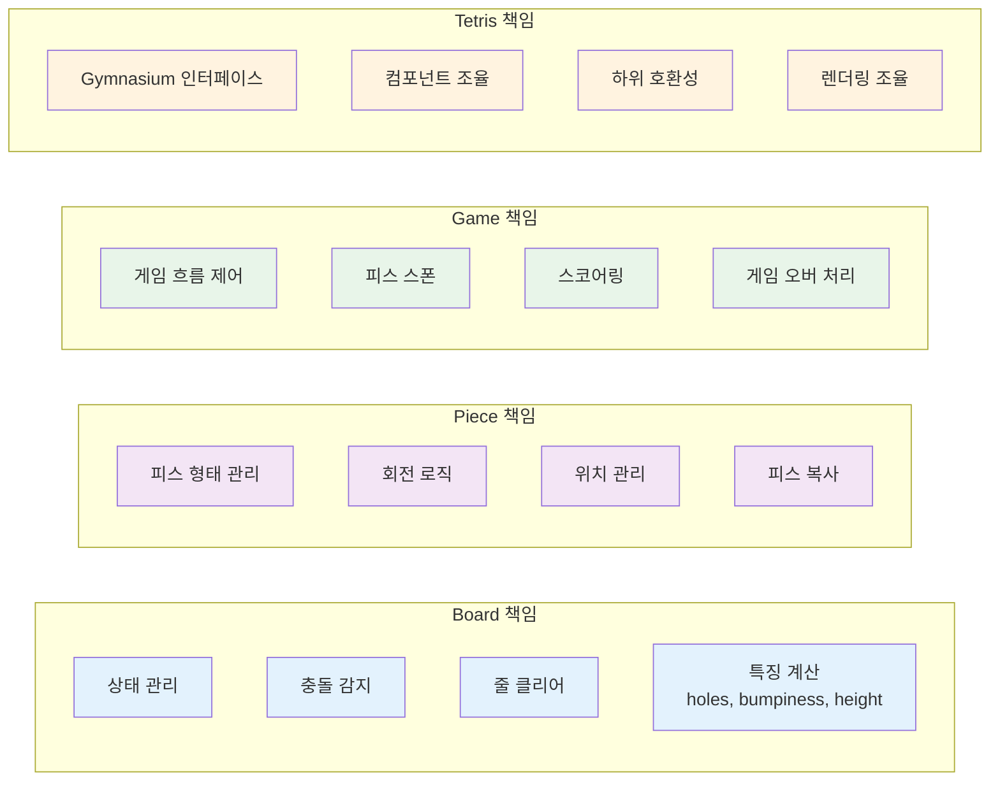
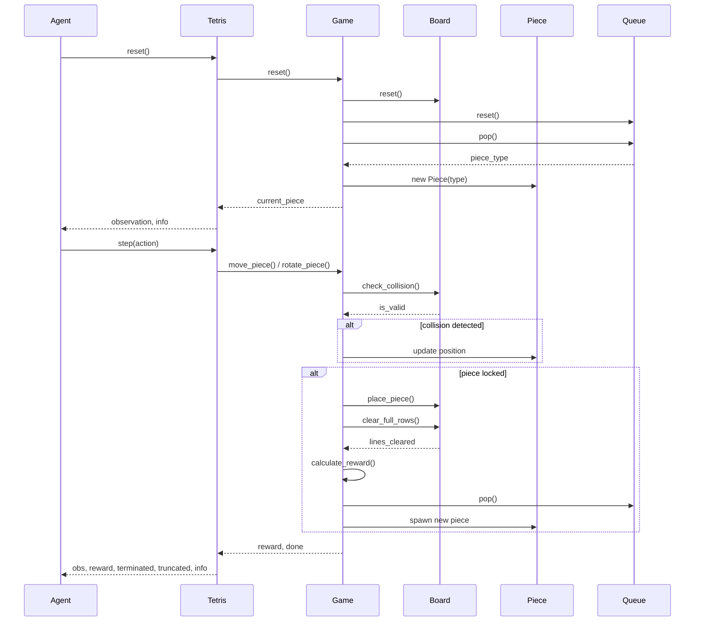
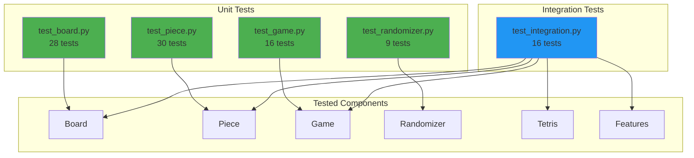
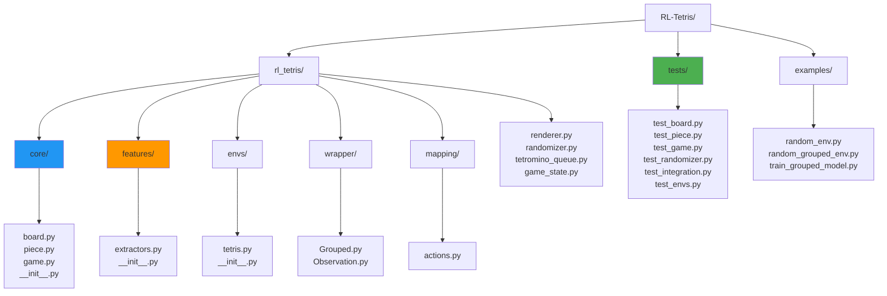

# RL-Tetris 아키텍처 문서

리팩토링된 RL-Tetris 프로젝트의 아키텍처 구조를 설명합니다.

## 목차
- [전체 아키텍처 구조](#전체-아키텍처-구조)
- [클래스 다이어그램](#클래스-다이어그램)
- [컴포넌트 책임 분리](#컴포넌트-책임-분리)
- [데이터 흐름](#데이터-흐름)
- [테스트 구조](#테스트-구조)
- [디렉토리 구조](#디렉토리-구조)
- [주요 개선 사항](#주요-개선-사항)

---

## 전체 아키텍처 구조



### 레이어 설명

1. **External Layer**: 사용자/에이전트와 Gymnasium API
2. **Environment Layer**: Tetris 환경과 Wrapper들
3. **Core Components**: 핵심 게임 로직 (Board, Piece, Game)
4. **Features**: 머신러닝을 위한 특징 추출
5. **Supporting Components**: 렌더링, 랜덤화 등 지원 컴포넌트

---

## 클래스 다이어그램



### 주요 클래스 설명

#### Tetris (Environment)
- Gymnasium 인터페이스 구현
- 모든 컴포넌트를 조율
- 하위 호환성 유지

#### Board
- 보드 상태 관리
- 충돌 감지
- 줄 클리어
- 특징 계산 (holes, bumpiness, height)

#### Piece
- 7가지 테트리스 피스 형태 관리
- 회전 로직 (시계방향/반시계방향)
- 위치 관리

#### Game
- 게임 흐름 제어
- 피스 스폰 및 잠금
- 스코어링 및 보상 계산
- 게임 오버 처리

---

## 컴포넌트 책임 분리



### SOLID 원칙 준수

각 컴포넌트는 **단일 책임 원칙(SRP)**을 따르며:
- **Board**: 보드 상태와 관련된 모든 작업
- **Piece**: 피스와 관련된 모든 작업
- **Game**: 게임 로직과 관련된 모든 작업
- **Tetris**: Gymnasium 인터페이스와 컴포넌트 조율

---

## 데이터 흐름



### 데이터 흐름 설명

1. **Reset 단계**: 환경 초기화, 보드/큐 리셋, 첫 피스 스폰
2. **Step 단계**: 액션 실행, 충돌 감지, 피스 이동
3. **Lock 단계**: 피스 고정, 줄 클리어, 보상 계산, 새 피스 스폰

---

## 테스트 구조



### 테스트 커버리지

- **총 99개 테스트**
- **유닛 테스트**: 83개 (각 컴포넌트 독립 테스트)
- **통합 테스트**: 16개 (컴포넌트 간 상호작용 테스트)

#### 테스트 파일별 내용

| 파일 | 테스트 수 | 커버리지 |
|------|----------|---------|
| test_board.py | 28 | Board 클래스 전체 기능 |
| test_piece.py | 30 | Piece 클래스 전체 기능 |
| test_game.py | 16 | Game 클래스 핵심 로직 |
| test_randomizer.py | 9 | BagRandomizer, RandRandomizer |
| test_integration.py | 16 | 환경 통합, 하위 호환성, 특징 추출 |

---

## 디렉토리 구조



### 주요 디렉토리 설명

```
RL-Tetris/
├── rl_tetris/              # 메인 패키지
│   ├── core/              # 핵심 컴포넌트 (새로 추가)
│   │   ├── board.py       # Board 클래스
│   │   ├── piece.py       # Piece 클래스
│   │   ├── game.py        # Game 클래스
│   │   └── __init__.py
│   ├── features/          # 특징 추출 모듈 (새로 추가)
│   │   ├── extractors.py  # 특징 추출 클래스
│   │   └── __init__.py
│   ├── envs/              # Gymnasium 환경
│   │   └── tetris.py      # Tetris 환경 (리팩토링됨)
│   ├── wrapper/           # 환경 래퍼
│   ├── mapping/           # 액션 정의
│   ├── renderer.py        # 렌더링
│   ├── randomizer.py      # 랜덤화
│   ├── tetromino_queue.py # 피스 큐
│   └── game_state.py      # 게임 상태
├── tests/                 # 테스트 스위트 (대폭 확장)
│   ├── test_board.py      # Board 테스트
│   ├── test_piece.py      # Piece 테스트
│   ├── test_game.py       # Game 테스트
│   ├── test_randomizer.py # Randomizer 테스트
│   ├── test_integration.py# 통합 테스트
│   └── test_envs.py       # 기존 테스트
├── examples/              # 사용 예제
│   ├── random_env.py
│   ├── random_grouped_env.py
│   └── train_grouped_model.py
└── test_refactored_env.py # 검증 스크립트
```

---

## 주요 개선 사항

### Before vs After 비교

| 항목 | Before | After |
|------|--------|-------|
| **구조** | 단일 파일 (344줄) | 모듈화된 컴포넌트 |
| **책임 분리** | 혼재됨 | 명확한 단일 책임 |
| **테스트** | 1개 (placeholder) | 99개 (포괄적) |
| **특징 추출** | 환경 내 혼재 | 독립 모듈 |
| **재사용성** | 낮음 | 높음 |
| **유지보수성** | 어려움 | 쉬움 |
| **확장성** | 제한적 | 우수 |
| **코드 중복** | 있음 | 최소화 |

### 리팩토링 통계

```
12 files changed, 2631 insertions(+), 265 deletions(-)
```

#### 새로 추가된 파일
- `rl_tetris/core/board.py` (299 lines)
- `rl_tetris/core/piece.py` (237 lines)
- `rl_tetris/core/game.py` (257 lines)
- `rl_tetris/features/extractors.py` (191 lines)
- `tests/test_board.py` (310 lines)
- `tests/test_piece.py` (270 lines)
- `tests/test_game.py` (150 lines)
- `tests/test_randomizer.py` (119 lines)
- `tests/test_integration.py` (220 lines)

#### 수정된 파일
- `rl_tetris/envs/tetris.py` (344 → 314 lines, -30 lines)

### 아키텍처 원칙

이 리팩토링은 다음 설계 원칙을 따릅니다:

1. **Single Responsibility Principle (SRP)**
   - 각 클래스는 하나의 명확한 책임만 가짐

2. **Open/Closed Principle (OCP)**
   - 확장에는 열려있고 수정에는 닫혀있음
   - 새로운 특징 추출기나 피스 타입 추가 용이

3. **Dependency Injection**
   - Board, Queue 등을 Game에 주입
   - 테스트 시 모킹 용이

4. **Composition over Inheritance**
   - Tetris가 Board, Game, Piece를 조합하여 사용

5. **Separation of Concerns**
   - 게임 로직, 렌더링, 특징 추출이 명확히 분리

### 이점

✅ **모듈화**: 각 컴포넌트를 독립적으로 테스트 및 개발 가능
✅ **테스트 용이성**: Pure function과 DI로 100% 테스트 가능
✅ **유지보수성**: 명확한 구조로 버그 수정과 기능 추가가 쉬움
✅ **확장성**: 새로운 특징, 피스 타입, 게임 모드 추가 용이
✅ **하위 호환성**: 기존 wrapper와 예제 코드 그대로 작동
✅ **재사용성**: 각 컴포넌트를 다른 프로젝트에서도 사용 가능

---

## 사용 예제

### 기본 사용법

```python
from rl_tetris.envs.tetris import Tetris
from rl_tetris.mapping.actions import GameActions

# 환경 생성
env = Tetris()

# 게임 시작
obs, info = env.reset()

# 액션 실행
obs, reward, terminated, truncated, info = env.step(GameActions.move_down)
```

### 컴포넌트 직접 사용

```python
from rl_tetris.core import Board, Piece, Game
from rl_tetris.tetromino_queue import TetrominoQueue
from rl_tetris.randomizer import BagRandomizer

# 컴포넌트 생성
board = Board(height=20, width=10)
queue = TetrominoQueue(BagRandomizer())
game = Game(board, queue)

# 게임 시작
game.reset()

# 피스 이동
game.move_piece(1, 0)  # 오른쪽으로 이동
game.rotate_piece()     # 회전
game.hard_drop()        # 하드 드롭
```

### 특징 추출

```python
from rl_tetris.features import BoardFeatureExtractor

# 특징 추출
features = BoardFeatureExtractor.extract_features(board)
# Output: [lines_cleared, holes, bumpiness, total_height]

# 특징 이름 확인
names = BoardFeatureExtractor.get_feature_names()
# Output: ['lines_cleared', 'holes', 'bumpiness', 'total_height']
```

---

## 결론

이 리팩토링을 통해 RL-Tetris 프로젝트는:

1. **더 명확한 구조**를 갖게 되었습니다
2. **테스트 가능한 코드**로 변경되었습니다
3. **유지보수가 쉬운** 코드베이스가 되었습니다
4. **확장 가능한 아키텍처**를 갖추었습니다
5. **하위 호환성**을 유지했습니다

이제 새로운 기능을 추가하거나 버그를 수정하기가 훨씬 쉬워졌으며, 각 컴포넌트를 독립적으로 테스트할 수 있습니다.

---

**작성일**: 2025-11-21
**버전**: 0.2.0
**작성자**: Claude AI
