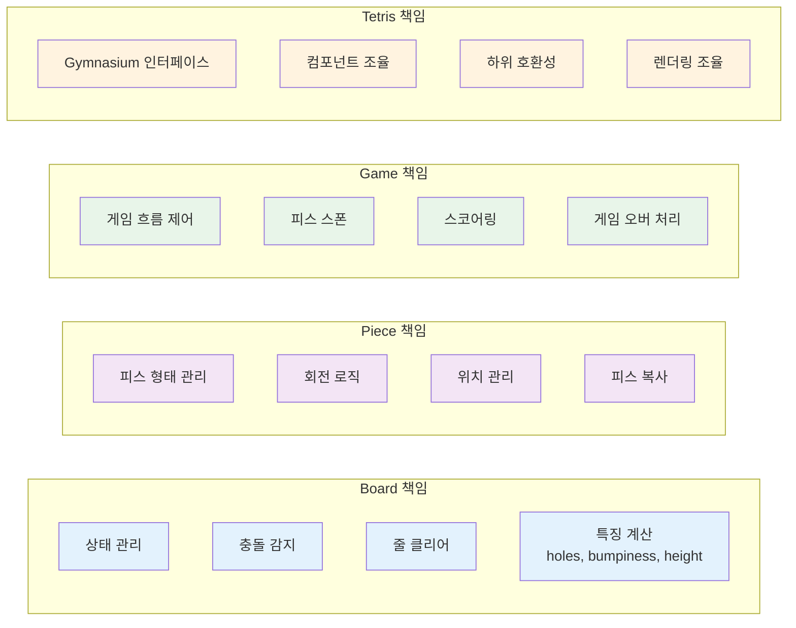

[](https://pypi.org/project/rl-tetris/)

# RL-Tetris


**RL-Tetris**는 강화학습을 위해 Gymnasium 인터페이스를 기반으로 구현된 테트리스 게임 환경입니다.

[Gymnasium](https://gymnasium.farama.org/index.html)은 OpenAI가 개발한 강화학습 연구를 위한 표준화된 환경 라이브러리로, 간단한 인터페이스를 통해 환경을 초기화하고 에이전트의 행동과 보상을 확인할 수 있어 연구와 실험에 널리 활용됩니다.

## RL-Tetris 설치

```bash
pip install rl-tetris
```

Python 3.10+

## 사용 예시

**GroupedWrapper**를 적용한 RL-Tetris 강화학습 환경에서 랜덤한 액션을 취하는 에이전트 예시는 다음과 같습니다.

```python
import time
import gymnasium as gym

from rl_tetris.wrapper.Grouped import GroupedWrapper
from rl_tetris.wrapper.Observation import GroupedFeaturesObservation

env = gym.make("RL-Tetris-v0", render_mode="human")
env = GroupedWrapper(env, observation_wrapper=GroupedFeaturesObservation(env))
obs, info = env.reset()

done = False
while True:
    env.render()

    action = env.action_space.sample(obs["action_mask"])

    obs, _, done, _, info = env.step(action)

    time.sleep(1)

    if done:
        env.render()
        time.sleep(3)
        break
```

Deep Q-learning을 통해 강화학습을 수행하는 예시는 [다음 폴더](examples)에서 자세히 확인할 수 있습니다.

## 아키텍처

RL-Tetris는 모듈화되고 테스트 가능한 아키텍처를 갖추고 있습니다. 각 컴포넌트는 단일 책임 원칙(SRP)을 따르며, 명확하게 분리된 구조로 설계되었습니다.

### 전체 구조


### 컴포넌트 책임

각 컴포넌트는 명확한 책임을 가지고 있습니다:



### 디렉토리 구조


더 자세한 아키텍처 정보는 [ARCHITECTURE.md](ARCHITECTURE.md)를 참고하세요.

## 환경

### render_mode

```python
env = gym.make("RL-Tetris-v0", render_mode="human")
```

- `human`: 게임 화면을 렌더링합니다.
- `animate`: human에서 추가적으로 Hard Drop 애니메이션이 렌더링됩니다.
- `None`: 게임 화면을 렌더링하지 않습니다.

### GroupedWrapper

**GroupedWrapper**는 환경의 상태를 그룹화하여 반환하는 Wrapper입니다. 그룹화된 상태들은 에이전트가 학습하기에 적합한 형태로 변환됩니다.

그룹화된 상태들은 상단에서 현재 블록을 가장 좌측부터 가장 우측까지 나열하면서, 회전을 수행하면서 유효한 상태들의 모음입니다.
이는 다음 사진을 보면 이해할 수 있습니다.


위 사진은 현재 블록이 상단에서 위치가능한 경우들 중 3개만 뽑은 예시입니다.
(x, r)로 표시된 값은 현재 블록의 위치와 회전 상태를 나타냅니다.

### GroupedFeaturesObservation

**GroupedFeaturesObservation**은 그룹화된 상태들을 특징 벡터로 변환하는 Wrapper입니다. 그룹화된 상태들은 특징 벡터로 변환되어 에이전트에게 반환됩니다.

특징 벡터는 현재 착지된 블록들로부터 다음과 같은 4가지 정보를 얻어 구성됩니다.

- **지워진 줄 수**
- **구멍 수**
- **높이 편차**
- **높이 합**

## 라이센스

[MIT License](LICENSE)
