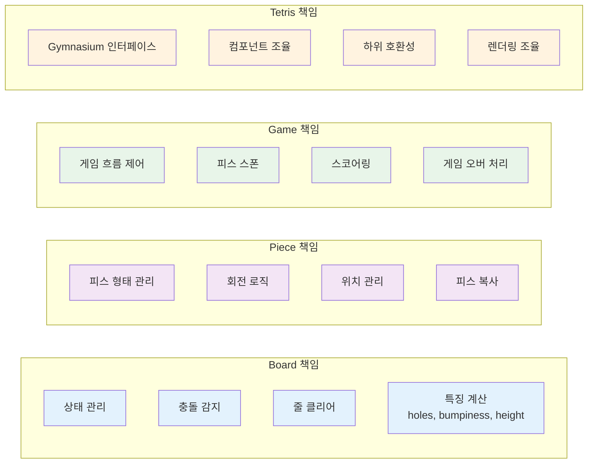
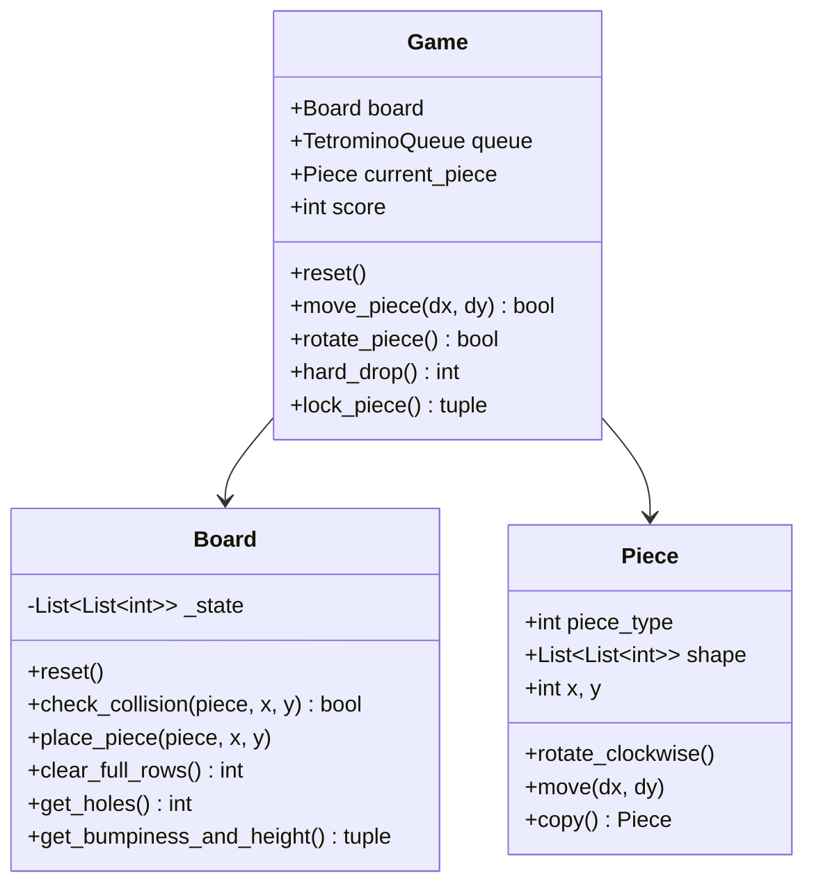

# Core Components

RL-Tetris의 핵심 컴포넌트는 `rl_tetris/core/` 디렉토리에 위치하며, 각각 명확한 책임을 가지고 있습니다.

## Component Responsibilities



## Board

**위치**: `rl_tetris/core/board.py`

Board 클래스는 테트리스 게임 보드의 상태를 관리합니다.

### 주요 기능

#### 1. 상태 관리
```python
from rl_tetris.core import Board

board = Board(height=20, width=10)
board.reset()  # 보드 초기화

# 상태 가져오기/설정하기
state = board.get_state()
board.set_state(state)
```

#### 2. 충돌 감지
```python
from rl_tetris.core import Board, Piece

board = Board(height=20, width=10)
piece = Piece(piece_type=0)  # I 피스

# 충돌 검사
is_collision = board.check_collision(piece, x=5, y=10)
```

#### 3. 피스 배치
```python
# 보드에 피스 배치
board.place_piece(piece, x=5, y=18)
```

#### 4. 줄 클리어
```python
# 가득 찬 줄 제거 및 개수 반환
lines_cleared = board.clear_full_rows()
print(f"Cleared {lines_cleared} lines")
```

#### 5. 특징 계산
```python
# 구멍 개수
holes = board.get_holes()

# 높이 편차와 총 높이
bumpiness, total_height = board.get_bumpiness_and_height()

# 각 열의 높이
heights = board.get_column_heights()
```

### 설계 특징

- **순수 함수**: 대부분의 메서드가 부작용 없이 동작
- **테스트 가능**: 상태를 쉽게 설정/가져올 수 있어 테스트 용이
- **특징 추출**: ML을 위한 다양한 보드 특징 제공

[→ Board API 문서](../api/core/board.md)

---

## Piece

**위치**: `rl_tetris/core/piece.py`

Piece 클래스는 테트리스 피스(테트로미노)를 관리합니다.

### 7가지 피스 타입

| Type | Name | Shape |
|------|------|-------|
| 0 | I | `████` |
| 1 | O | `██`<br>`██` |
| 2 | T | `███`<br>` █` |
| 3 | S | ` ██`<br>`██` |
| 4 | Z | `██`<br>` ██` |
| 5 | J | `█`<br>`███` |
| 6 | L | `  █`<br>`███` |

### 주요 기능

#### 1. 피스 생성
```python
from rl_tetris.core import Piece

# I 피스 생성
i_piece = Piece(piece_type=0)

# T 피스 생성
t_piece = Piece(piece_type=2)
```

#### 2. 회전
```python
# 시계방향 회전
piece.rotate_clockwise()

# 모든 회전 상태 가져오기
rotations = piece.get_all_rotations()
# I 피스: 2가지 회전, O 피스: 1가지, 나머지: 4가지
```

#### 3. 이동
```python
# 상대 이동
piece.move(dx=1, dy=0)  # 오른쪽으로

# 절대 위치 설정
piece.set_position(x=5, y=10)
```

#### 4. 복사
```python
# 피스 복사 (시뮬레이션에 유용)
copied_piece = piece.copy()
copied_piece.rotate_clockwise()  # 원본에 영향 없음
```

### 설계 특징

- **불변성 지원**: `copy()` 메서드로 안전한 복사
- **회전 최적화**: 각 피스 타입별 회전 상태 미리 정의
- **간단한 인터페이스**: 직관적인 메서드명

[→ Piece API 문서](../api/core/piece.md)

---

## Game

**위치**: `rl_tetris/core/game.py`

Game 클래스는 게임의 전체 흐름을 제어합니다.

### 주요 기능

#### 1. 게임 초기화
```python
from rl_tetris.core import Board, Game
from rl_tetris.tetromino_queue import TetrominoQueue
from rl_tetris.randomizer import BagRandomizer

board = Board(height=20, width=10)
queue = TetrominoQueue(BagRandomizer())
game = Game(board, queue)

game.reset()
```

#### 2. 피스 조작
```python
# 피스 이동 (성공 시 True 반환)
moved = game.move_piece(dx=1, dy=0)  # 오른쪽

# 피스 회전
rotated = game.rotate_piece()

# 하드 드롭 (떨어진 칸 수 반환)
rows_dropped = game.hard_drop()
```

#### 3. 피스 고정 및 스폰
```python
# 현재 피스 고정
lines_cleared, is_game_over = game.lock_piece()

if is_game_over:
    print("Game Over!")
else:
    # 새 피스 자동 스폰됨
    print(f"Cleared {lines_cleared} lines")
    print(f"Current score: {game.score}")
```

#### 4. 스코어링
```python
# 보상 계산
reward = game.calculate_reward(lines_cleared=2, overflow=False)

# 스코어 확인
print(f"Score: {game.score}")
print(f"Total cleared lines: {game.cleared_lines}")
```

### 게임 상태

Game 클래스는 다음 상태를 관리합니다:

- `current_piece`: 현재 피스
- `score`: 현재 점수
- `cleared_lines`: 총 클리어한 줄 수
- `gameover`: 게임 오버 여부

### 설계 특징

- **의존성 주입**: Board와 Queue를 주입받아 테스트 용이
- **명확한 인터페이스**: 각 액션이 명확한 반환값
- **보상 시스템**: 강화학습에 최적화된 보상 계산

[→ Game API 문서](../api/core/game.md)

---

## Component Interaction



## Usage Example

전체 사용 예제:

```python
from rl_tetris.core import Board, Game
from rl_tetris.tetromino_queue import TetrominoQueue
from rl_tetris.randomizer import BagRandomizer

# 컴포넌트 생성
board = Board(height=20, width=10)
queue = TetrominoQueue(BagRandomizer())
game = Game(board, queue)

# 게임 시작
game.reset()

# 게임 루프
while not game.gameover:
    # 피스 조작
    game.move_piece(1, 0)   # 오른쪽
    game.rotate_piece()      # 회전

    # 하드 드롭 및 고정
    rows_dropped = game.hard_drop()
    lines_cleared, is_game_over = game.lock_piece()

    # 보상 계산
    reward = game.calculate_reward(lines_cleared, is_game_over)

    print(f"Lines: {lines_cleared}, Reward: {reward}, Score: {game.score}")

    if is_game_over:
        break
```

## Next Steps

- [Data Flow](data-flow.md) - 컴포넌트 간 데이터 흐름
- [API Reference](../api/core/board.md) - 자세한 API 문서
