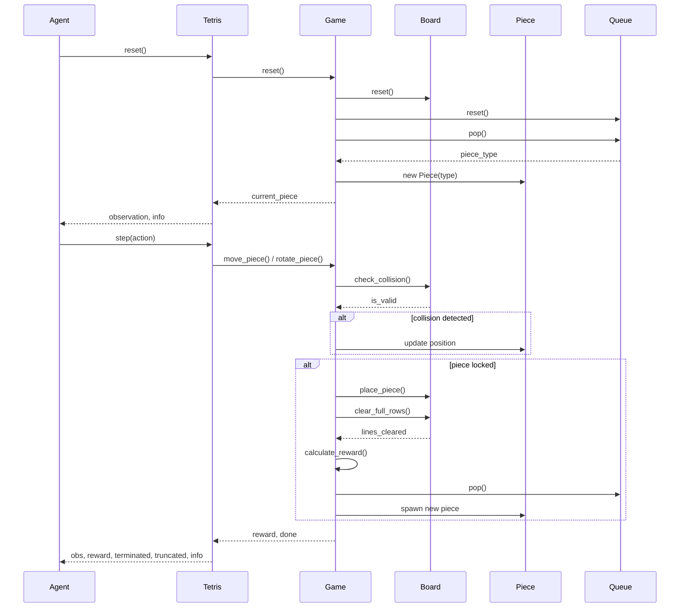
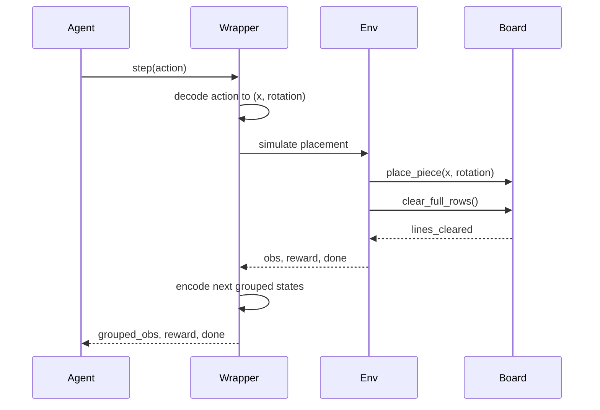
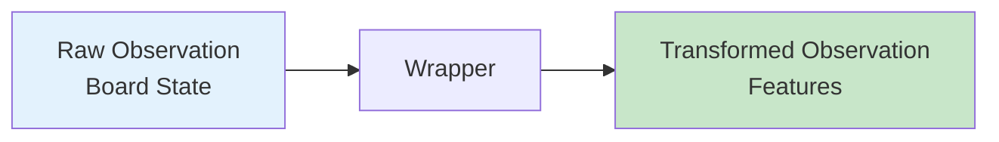
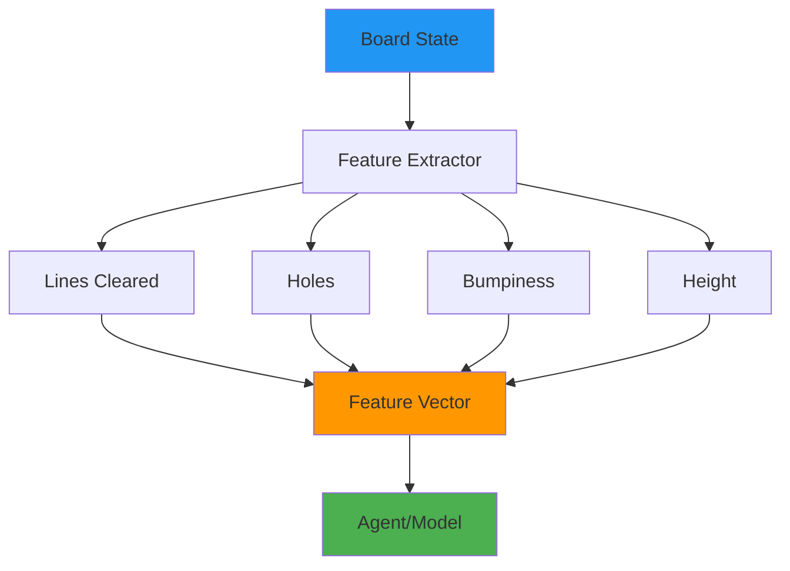

# Data Flow

이 문서는 RL-Tetris에서 데이터가 어떻게 흐르는지 설명합니다.

## Environment Lifecycle



## Reset Flow

환경을 초기화할 때의 데이터 흐름:

### 1. Agent → Tetris
```python
obs, info = env.reset()
```

### 2. Tetris → Game
```python
self.game.reset()
```

### 3. Game → Board, Queue
```python
self.board.reset()  # 보드 초기화
self.queue.reset()  # 큐 초기화
```

### 4. Game → Piece
```python
piece_type = self.queue.pop()
self.current_piece = Piece(piece_type)
```

### 5. Tetris → Agent
```python
observation = self.board.get_state()
info = {"score": 0, "lines": 0}
return observation, info
```

## Step Flow

액션을 실행할 때의 데이터 흐름:

### 1. Move/Rotate Actions

```python
# Agent → Tetris
obs, reward, terminated, truncated, info = env.step(action)
```

#### Move Left/Right
```python
# Tetris → Game
success = self.game.move_piece(dx, dy)

# Game → Board (collision check)
if not self.board.check_collision(piece, new_x, new_y):
    piece.move(dx, dy)
    return True
return False
```

#### Rotate
```python
# Tetris → Game
success = self.game.rotate_piece()

# Game → Piece
piece.rotate_clockwise()

# Game → Board (collision check)
if self.board.check_collision(rotated_piece, x, y):
    piece.rotate_counterclockwise()  # 되돌리기
    return False
return True
```

### 2. Hard Drop Action

```python
# Tetris → Game
rows_dropped = self.game.hard_drop()

# Game → Board (반복 충돌 체크)
while not self.board.check_collision(piece, x, y+1):
    y += 1
    rows_dropped += 1

piece.set_position(x, y)
return rows_dropped
```

### 3. Lock Piece

피스가 바닥에 도달하거나 hard drop 후:

```python
# Game → Board
self.board.place_piece(piece, x, y)

# Board → Game
lines_cleared = self.board.clear_full_rows()

# Game → Game (scoring)
self.score += self._calculate_score(lines_cleared)
self.cleared_lines += lines_cleared

# Game → Queue (new piece)
piece_type = self.queue.pop()
self.current_piece = Piece(piece_type)

# Game → Board (game over check)
if self.board.check_collision(self.current_piece, x, y):
    self.gameover = True
    return lines_cleared, True
return lines_cleared, False
```

### 4. Return to Agent

```python
# Tetris → Agent
observation = self.board.get_state()
reward = self.game.calculate_reward(lines_cleared, is_game_over)
terminated = is_game_over
truncated = False
info = {
    "score": self.game.score,
    "lines": self.game.cleared_lines
}
return observation, reward, terminated, truncated, info
```

## Wrapper Flow

Wrapper를 사용할 때의 데이터 변환:

### GroupedWrapper



#### Grouped Action Encoding

```python
# Agent: 단일 액션 (그룹화된 상태 인덱스)
action = 42

# Wrapper: (x, rotation) 튜플로 디코딩
x, rotation = self._decode_action(action)

# Env: 시뮬레이션
for _ in range(rotation):
    piece.rotate_clockwise()
piece.set_position(x, y)
env.hard_drop()
```

### ObservationWrapper



#### GroupedFeaturesObservation

```python
# Raw observation (board state)
raw_obs = board.get_state()  # (20, 10) numpy array

# Wrapper transformation
features = []
for x, rotation in valid_placements:
    # 시뮬레이션
    simulated_board = board.copy()
    simulated_board.place_piece(piece, x, rotation)
    lines = simulated_board.clear_full_rows()

    # 특징 추출
    feature = BoardFeatureExtractor.extract_features(
        simulated_board, lines
    )
    features.append(feature)

# Transformed observation
grouped_obs = {
    "features": np.array(features),  # (N, 4)
    "action_mask": action_mask        # (N,)
}
```

## Feature Extraction Flow



### Feature Calculation

```python
from rl_tetris.features import BoardFeatureExtractor

# 보드에서 특징 추출
features = BoardFeatureExtractor.extract_features(board, lines_cleared)

# features = [lines_cleared, holes, bumpiness, total_height]
```

#### Holes
```python
def get_holes(self):
    holes = 0
    for x in range(self.width):
        block_found = False
        for y in range(self.height):
            if self._state[y][x] != 0:
                block_found = True
            elif block_found:
                holes += 1
    return holes
```

#### Bumpiness & Height
```python
def get_bumpiness_and_height(self):
    heights = self.get_column_heights()
    bumpiness = sum(abs(heights[i] - heights[i+1])
                   for i in range(len(heights)-1))
    total_height = sum(heights)
    return bumpiness, total_height
```

## State Synchronization

Tetris 환경은 하위 호환성을 위해 상태를 동기화합니다:

```python
def _sync_state_for_wrappers(self):
    """Wrapper 호환성을 위한 상태 동기화"""
    self.anchor = (self.game.current_piece.x, self.game.current_piece.y)
    self.shape = self.game.current_piece.shape
    self.board_with_piece = self.board.get_state()

    # 현재 피스를 보드에 오버레이
    piece = self.game.current_piece
    for py, row in enumerate(piece.shape):
        for px, cell in enumerate(row):
            if cell != 0:
                y, x = piece.y + py, piece.x + px
                if 0 <= y < self.height and 0 <= x < self.width:
                    self.board_with_piece[y][x] = cell
```

## Data Types

### Observation Space

```python
# Basic environment
observation_space = Box(
    low=0,
    high=7,
    shape=(20, 10),
    dtype=np.int32
)

# GroupedFeaturesObservation
observation_space = Dict({
    "features": Box(
        low=-np.inf,
        high=np.inf,
        shape=(max_actions, 4),
        dtype=np.float32
    ),
    "action_mask": Box(
        low=0,
        high=1,
        shape=(max_actions,),
        dtype=np.int8
    )
})
```

### Action Space

```python
# Basic environment
action_space = Discrete(6)
# 0: left, 1: right, 2: down, 3: rotate_cw, 4: rotate_ccw, 5: hard_drop

# GroupedWrapper
action_space = Discrete(max_actions)
# 각 액션은 (x, rotation) 조합을 나타냄
```

## Next Steps

- [Core Components](core-components.md) - 각 컴포넌트 상세 설명
- [API Reference](../api/core/board.md) - 자세한 API 문서
