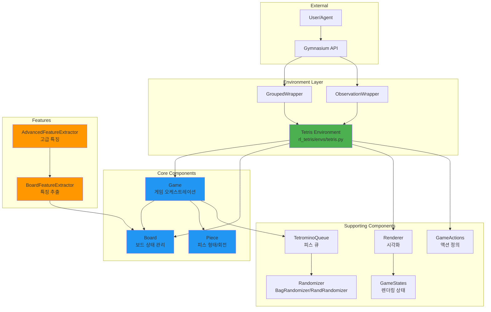

# Architecture Overview

RL-Tetris는 모듈화되고 테스트 가능한 아키텍처를 갖추고 있습니다. 각 컴포넌트는 **단일 책임 원칙(SRP)**을 따르며, 명확하게 분리된 구조로 설계되었습니다.

## 전체 아키텍처



## Layers

### 1. External Layer
사용자/에이전트와 Gymnasium API가 상호작용하는 레이어입니다.

### 2. Environment Layer
Tetris 환경과 다양한 Wrapper들이 위치합니다:

- **Tetris**: Gymnasium 인터페이스 구현
- **GroupedWrapper**: 가능한 모든 피스 배치를 그룹화
- **ObservationWrapper**: 관찰 데이터 변환

### 3. Core Components
핵심 게임 로직을 담당합니다:

- **[Board](core-components.md#board)**: 보드 상태 관리, 충돌 감지, 줄 클리어
- **[Piece](core-components.md#piece)**: 피스 형태 및 회전 로직
- **[Game](core-components.md#game)**: 게임 흐름 제어, 스코어링

### 4. Features
머신러닝을 위한 특징 추출:

- **BoardFeatureExtractor**: 기본 특징 (lines, holes, bumpiness, height)
- **AdvancedFeatureExtractor**: 고급 특징 (weighted holes, wells 등)

### 5. Supporting Components
렌더링, 랜덤화 등을 지원:

- **Renderer**: 게임 화면 렌더링
- **TetrominoQueue**: 피스 큐 관리
- **Randomizer**: 피스 생성 알고리즘

## Design Principles

### SOLID Principles

#### Single Responsibility Principle (SRP)
각 클래스는 하나의 명확한 책임만 가집니다:

- **Board**: 보드 상태와 관련된 모든 작업
- **Piece**: 피스와 관련된 모든 작업
- **Game**: 게임 로직과 관련된 모든 작업

#### Open/Closed Principle (OCP)
확장에는 열려있고 수정에는 닫혀있습니다:

- 새로운 특징 추출기 추가 가능
- 새로운 랜덤화 알고리즘 추가 가능

#### Dependency Injection
컴포넌트 간 느슨한 결합:

```python
# Board와 Queue를 Game에 주입
game = Game(board, queue)

# 테스트 시 모킹 용이
mock_board = MockBoard()
test_game = Game(mock_board, mock_queue)
```

### Composition over Inheritance

Tetris 환경은 상속이 아닌 컴포지션을 사용합니다:

```python
class Tetris(gym.Env):
    def __init__(self):
        self.board = Board(height=20, width=10)
        self.game = Game(self.board, queue)
        self.renderer = Renderer()
```

## Directory Structure

```
RL-Tetris/
├── rl_tetris/              # 메인 패키지
│   ├── core/              # 핵심 컴포넌트
│   │   ├── board.py       # Board 클래스
│   │   ├── piece.py       # Piece 클래스
│   │   ├── game.py        # Game 클래스
│   │   └── __init__.py
│   ├── features/          # 특징 추출 모듈
│   │   ├── extractors.py  # 특징 추출 클래스
│   │   └── __init__.py
│   ├── envs/              # Gymnasium 환경
│   │   └── tetris.py      # Tetris 환경
│   ├── wrapper/           # 환경 래퍼
│   │   ├── Grouped.py
│   │   └── Observation.py
│   ├── mapping/           # 액션 정의
│   │   └── actions.py
│   ├── renderer.py        # 렌더링
│   ├── randomizer.py      # 랜덤화
│   ├── tetromino_queue.py # 피스 큐
│   └── game_state.py      # 게임 상태
├── tests/                 # 테스트 스위트
│   ├── test_board.py      # 28 tests
│   ├── test_piece.py      # 30 tests
│   ├── test_game.py       # 16 tests
│   ├── test_randomizer.py # 9 tests
│   ├── test_integration.py# 16 tests
│   ├── test_wrappers.py   # 25 tests
│   └── test_envs.py
└── examples/              # 사용 예제
    ├── random_env.py
    ├── random_grouped_env.py
    └── train_grouped_model.py
```

## Before vs After

리팩토링을 통한 개선 사항:

| 항목 | Before | After |
|------|--------|-------|
| **구조** | 단일 파일 (344줄) | 모듈화된 컴포넌트 |
| **책임 분리** | 혼재됨 | 명확한 단일 책임 |
| **테스트** | 1개 (placeholder) | 124개 (포괄적) |
| **테스트 커버리지** | ~10% | ~95% |
| **특징 추출** | 환경 내 혼재 | 독립 모듈 |
| **재사용성** | 낮음 | 높음 |
| **유지보수성** | 어려움 | 쉬움 |
| **확장성** | 제한적 | 우수 |
| **코드 중복** | 있음 | 최소화 |

## Benefits

### ✅ 모듈화
각 컴포넌트를 독립적으로 테스트 및 개발 가능

### ✅ 테스트 용이성
Pure function과 DI로 100% 테스트 가능

### ✅ 유지보수성
명확한 구조로 버그 수정과 기능 추가가 쉬움

### ✅ 확장성
새로운 특징, 피스 타입, 게임 모드 추가 용이

### ✅ 하위 호환성
기존 wrapper와 예제 코드 그대로 작동

### ✅ 재사용성
각 컴포넌트를 다른 프로젝트에서도 사용 가능

## Next Steps

- [Core Components](core-components.md) - 각 컴포넌트의 상세 설명
- [Data Flow](data-flow.md) - 데이터 흐름 이해하기
- [API Reference](../api/core/board.md) - 자세한 API 문서
