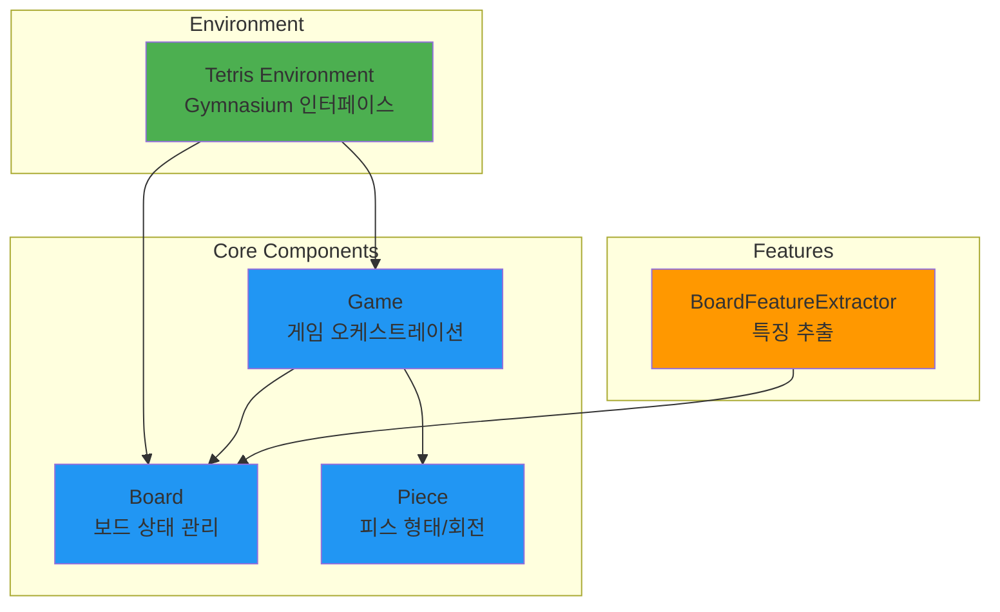

# RL-Tetris

[](https://pypi.org/project/rl-tetris/)
[](https://github.com/hot666666/RL-Tetris/actions/workflows/ci.yml)

**RL-Tetris**는 강화학습을 위해 Gymnasium 인터페이스를 기반으로 구현된 테트리스 게임 환경입니다.


## 주요 특징

- **Gymnasium 호환**: 표준화된 강화학습 인터페이스
- **모듈화된 아키텍처**: 각 컴포넌트가 명확하게 분리되어 있습니다
- **포괄적인 테스트**: 124개의 테스트로 안정성 보장
- **특징 추출**: ML을 위한 다양한 보드 특징 추출 기능
- **유연한 Wrapper**: GroupedWrapper, ObservationWrapper 등 제공

## 빠른 시작

### 설치

```bash
pip install rl-tetris
```

Python 3.10 이상이 필요합니다.

### 기본 사용법

```python
import gymnasium as gym
from rl_tetris.wrapper.Grouped import GroupedWrapper
from rl_tetris.wrapper.Observation import GroupedFeaturesObservation

# 환경 생성
env = gym.make("RL-Tetris-v0", render_mode="human")
env = GroupedWrapper(env, observation_wrapper=GroupedFeaturesObservation(env))

# 게임 실행
obs, info = env.reset()
done = False

while not done:
    env.render()
    action = env.action_space.sample(obs["action_mask"])
    obs, reward, done, truncated, info = env.step(action)
```

## 아키텍처 개요

RL-Tetris는 단일 책임 원칙(SRP)을 따르는 모듈화된 아키텍처로 설계되었습니다:



자세한 내용은 [Architecture](architecture/overview.md) 섹션을 참조하세요.

## 문서 구조

- **[Getting Started](getting-started/installation.md)**: 설치 및 시작 가이드
- **[Architecture](architecture/overview.md)**: 프로젝트 구조 및 설계 원칙
- **[API Reference](api/core/board.md)**: 자세한 API 문서
- **[Contributing](contributing.md)**: 기여 가이드

## 라이센스

[MIT License](license.md)
